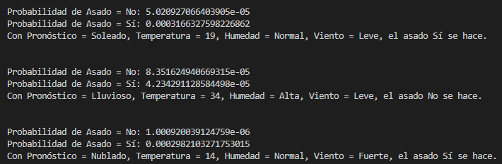

# Práctica 3 - Clasificador de Bayes

**Integrantes**
Roberto Barrero Santoyo
Luis Valencia Serrano

## Implementación

Implementamos una clase `NaiveBayesClassifier` con los atributos necesarios para poder entrenar y predecir resultados en base a un conjunto de datos.

```python
class NaiveBayesClassifier:
    # Clase para clasificar datos usando el algoritmo Naive Bayes
    def __init__(self, className='class'):
        self.class_counts = defaultdict(int)
        self.feature_counts_per_class = defaultdict(lambda: defaultdict(int))
        self.feature_count_global = defaultdict(int)
        self.feature_probabilities = defaultdict(lambda: defaultdict(float))
        self.class_probabilities = defaultdict(lambda: defaultdict(float))
        self.classes = set()
        self.features = set()
        self.className = className
        self.training_data = None
```

**Función Train**

Dentro de la clase `NaiveBayesClassifier` se definió la función ``train()`, que recibe un conjunto de datos (entradas) y las utiliza para "entrenar" y calcular las probabilidades de las características o parámetros.

La función diferencía entre valores categóricos y numéricos, calculando la probabilidad en base al número de apariciones de un valor entre el total de valores o suponiendo una distribución normal y calculando la probabilidad del valor basado en los datos de entrenamiento, para cada una de las clases disponibles.

En este caso, la única característica o parámetro numérico es la Temperatura.

```python
    # Entrena el clasificador con los datos
    def train(self, data):
        # Calcular numero de veces que aparece cada clase
        self.training_data = data
        for entry in data:
            # Agregar clase a clases
            self.class_counts[entry[self.className]] += 1
            self.classes.add(entry[self.className])

            # Agregar parametros a feature_counts y contar apariciones
            for feature, value in entry.items():
                if feature != self.className:
                    self.features.add(feature)
                    if type(value) == int or type(value) == float:
                        self.feature_counts_per_class[entry[self.className]
                                                      ][feature, value] = 0
                        self.feature_count_global[feature, value] = 0
                    else:
                        self.feature_counts_per_class[entry[self.className]
                                                      ][feature, value] += 1
                        self.feature_count_global[feature, value] += 1

        # Calcular probabilidades de cada clase y de cada feature
        for class_ in self.classes:
            # Calcular probabilidad de clase
            self.class_probabilities[class_] = self.class_counts[class_] / \
                len(data)
            # Calcular probabilidad condicional de cada parametro
            for feature, value in self.feature_counts_per_class[class_].keys():
                if type(value) == int or type(value) == float:
                    self.feature_probabilities[class_][feature,
                                                       value] = self.get_feature_probability(feature, value, class_)
                else:
                    self.feature_probabilities[class_][feature,
                                                       value] = self.feature_counts_per_class[class_][feature, value] / self.class_counts[class_]
```

**Función Predict**

De igual forma, la función `predict()` se definió dentro de la clase `NaiveBayesClassifier` y calcula las probabilidades de cada clase, basado en los datos de entrenamiento correspondientes a cada clase, y devuelve el valor de la clase con mayor probabilidad.

Esta función también distingue entre parámetros categóricos o numéricos. En el caso de los categóricos, simplemente utiliza la probabilidad condicional de que el parametro x_1 se dé dado que la clase es y_1. En el caso de los numéricos, se calcula la probabilidad del valor.

```python
    # Predice la clase de una entrada

    def predict(self, entry):
        predicted_probabilities = {}
        for class_ in self.classes:
            predicted_probabilities[class_] = self.class_probabilities[class_]
            for feature, value in entry.items():
                if feature != self.className:
                    predicted_probabilities[class_] *= self.get_feature_probability(
                        feature, value, class_)

        return max(predicted_probabilities, key=predicted_probabilities.get)
```

**Funciones auxiliares**

- `calculate_gaussian_probability()`: Calcula la media, varianza y posteriormente la probabilidad de un valor `x`

```python
    # Calcula la probabilidad de un valor suponiendo una distribucion normal
    def calculate_gaussian_probability(self, feature, value, class_):
        entries = [
            entry for entry in self.training_data if entry["Asado"] == class_]
        mean = 0
        for entry in entries:
            mean += entry[feature]
        mean /= float(self.class_counts[class_])

        variance = sum([pow(x[feature]-mean, 2) for x in entries]) / \
            float(self.class_counts[class_]-1)
        stdev = math.sqrt(variance)

        # print(f"Mean: {mean}, Stdev: {stdev}")D

        return 1/(math.sqrt(2*math.pi)*math.pow(stdev, 2))*math.exp(-math.pow(value-mean, 2)/(2*math.pow(stdev, 2)))
```

- `get_feature_probability()`: Determina si el parámetro es categórico o numérico, y devuelve su valor correspondiente, es decir, la probabilidad condicional si es categórico o la probabilidad del valor suponiendo una distribución normal.

```python
    # Obtiene la probabilidad de un valor dado un feature y una clase
    def get_feature_probability(self, feature, value, class_):
        if type(value) == int or type(value) == float:
            return self.calculate_gaussian_probability(feature, value, class_)
        return self.feature_probabilities[class_].get((feature, value), 0.01)
```

## Resultados

Al predecir si se realizará o no el asado con las condiciones propuestas, obtuvimos los siguientes resultados:

